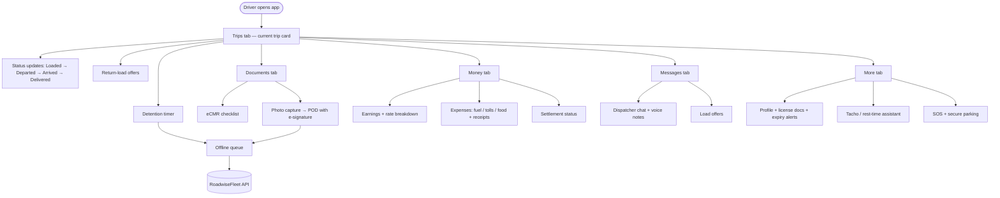
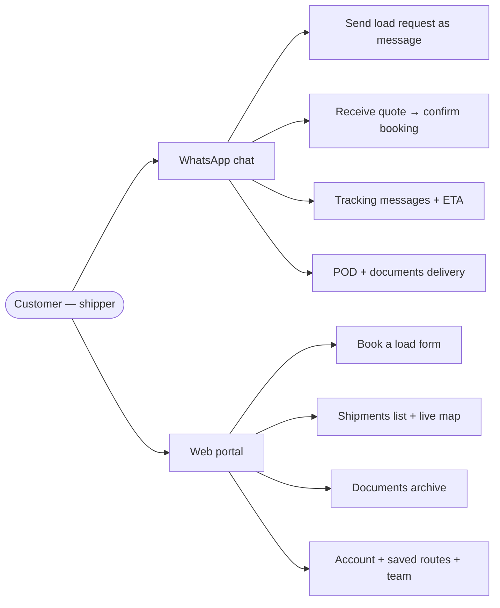
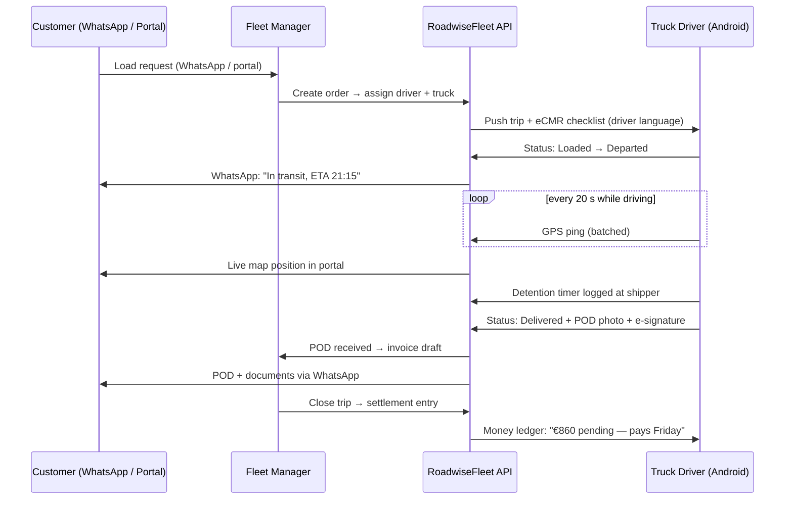
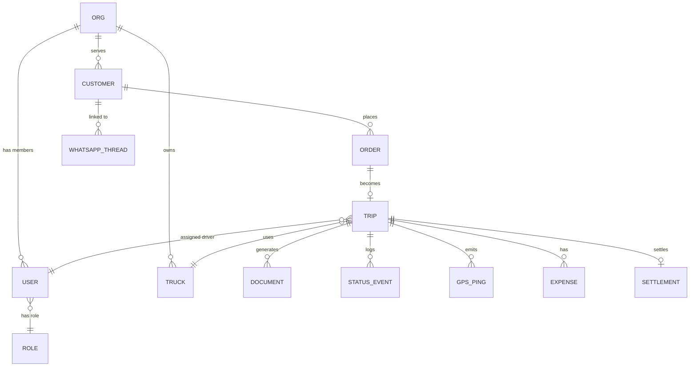

# RoadwiseFleet — Data & Menu Flow Diagrams (Mermaid)

Rendered natively by GitHub, and also served at `/diagrams` on the site (`web/diagrams.html`).
Source of truth: [product-menu-plan.md](product-menu-plan.md) · [backend-infrastructure-plan.md](backend-infrastructure-plan.md).

---

## 1. Menu flow — Truck Driver (Android)



## 2. Menu flow — Fleet Manager (web SaaS)

```mermaid
flowchart TD
    FM([Fleet Manager login]) --> Dash[Dashboard]
    Dash --> D1[KPI cards + live map]
    Dash --> D2[Alerts: detention / missing docs / empty trucks]
    Dash --> Disp[Dispatch]
    Disp --> S1[Drag-and-drop: load → driver]
    Disp --> S2[Return-load matching]
    Dash --> Trips[Trips]
    Trips --> T1[Trip detail: timeline + documents]
    Trips --> T2[Trip P&L: freight vs fuel / tolls / expenses]
    Trips --> T3[Invoice draft from POD]
    Dash --> Drivers[Drivers]
    Drivers --> DR1[Profiles + license / insurance expiry]
    Drivers --> DR2[Scorecards + retention bonuses]
    Drivers --> DR3[Advances + manual settlements]
    Dash --> Cust[Customers]
    Cust --> CU1[Order intake form]
    Cust --> CU2[WhatsApp inbox]
    Dash --> Comp[Compliance]
    Comp --> C1[eCMR document vault]
    Comp --> C2[Driver file expiry alerts]
    Dash --> Fin[Finance-lite]
    Fin --> F1[Receivables + reminders]
    Fin --> F2[Manual settlements]
    Dash --> Set[Settings]
    Set --> SE1[Users & roles: Owner / Dispatcher / Accountant]
    Set --> SE2[Language: EN / DE / PL / TR]
```



## 3. Menu flow — Customer (WhatsApp + portal)



## 4. Trip lifecycle — sequence



## 5. Data model — entity relationships



## 6. Data model — core attributes

```mermaid
%%{init: {"er": {"layoutDirection": "TB", "fontSize": 12}}}%%
erDiagram
    ORG {
        uuid id PK
        string name
        string locale
        string data_region
        string plan
    }
    USER {
        uuid id PK
        uuid org_id FK
        string role
        string name
        string phone
        string lang
    }
    ROLE {
        string id PK
        string permissions
    }
    TRUCK {
        uuid id PK
        uuid org_id FK
        string plate
        string dimensions
    }
    CUSTOMER {
        uuid id PK
        uuid org_id FK
        string name
        string whatsapp_id
    }
    ORDER {
        uuid id PK
        uuid customer_id FK
        string origin
        string destination
        string cargo
        string status
    }
    TRIP {
        uuid id PK
        uuid order_id FK
        uuid driver_id FK
        uuid truck_id FK
        string status
        decimal rate_eur
    }
    DOCUMENT {
        uuid id PK
        uuid trip_id FK
        string doc_type
        string storage_key
        string status
    }
    STATUS_EVENT {
        uuid id PK
        uuid trip_id FK
        string from_status
        string to_status
        timestamp happened_at
    }
    GPS_PING {
        uuid id PK
        uuid trip_id FK
        timestamp at
        decimal lat
        decimal lng
    }
    EXPENSE {
        uuid id PK
        uuid trip_id FK
        string category
        decimal amount_eur
    }
    SETTLEMENT {
        uuid id PK
        uuid trip_id FK
        decimal amount_eur
        string status
    }
    WHATSAPP_THREAD {
        uuid id PK
        uuid org_id FK
        uuid customer_id FK
        string phone
    }```

## 7. Trip status — state machine

```mermaid
stateDiagram-v2
    [*] --> DRAFT
    DRAFT --> ASSIGNED: FM dispatches
    ASSIGNED --> LOADED: driver confirms load
    LOADED --> IN_TRANSIT: departed
    IN_TRANSIT --> DELIVERED: arrived at destination
    DELIVERED --> POD_UPLOADED: photo + e-signature
    POD_UPLOADED --> INVOICED: FM bills customer
    INVOICED --> SETTLED: customer pays
    DRAFT --> CANCELLED
    ASSIGNED --> CANCELLED
    CANCELLED --> [*]
    SETTLED --> [*]
```

---

**Reading guide:** §1–3 are the navigation trees (what each role clicks). §4 is the single runtime flow that all menus project. §5–6 are the persistence model the API implements. §7 is the status enum every notification, filter, and KPI derives from.
