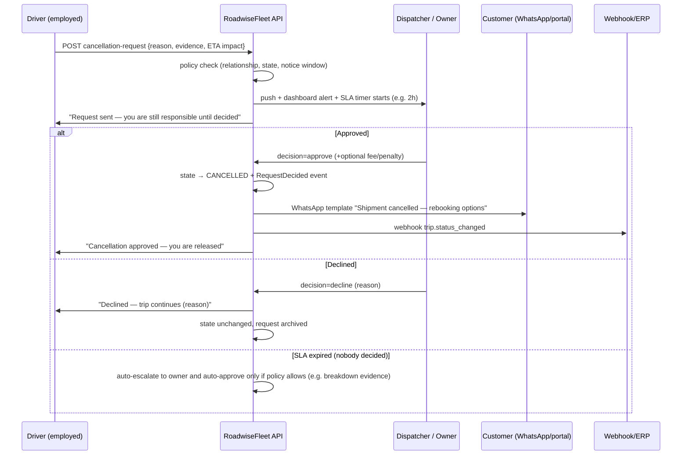
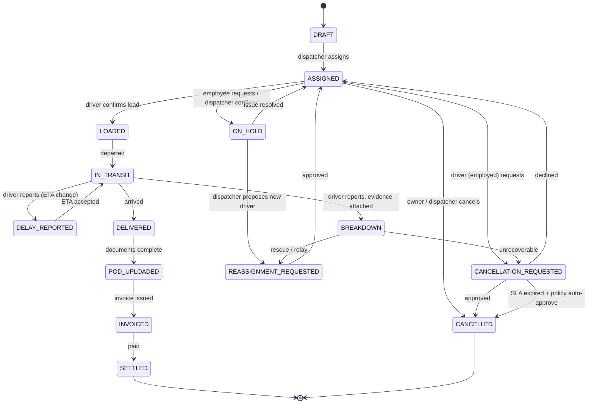

# RoadwiseFleet — Information Flow, Permissions & Risk Analysis

**Trigger for this analysis (founder's example):** *"Driver can cancel the load? Why? Cancellation should be **requested** if the driver is part of a fleet. If the driver is standalone, he can delete."*

**Verdict: the founder is right, and the gap is bigger than cancellation.** Our current design has a single global state machine with no actor-relationship model: any actor who can reach a trip can theoretically transition it. That is a governance hole across *every* mutating action — cancellation is just the first place it becomes dangerous.

---

## 1. The root gap: we model *what* happens, not *who may cause it*

What we have today:
- One state machine: `DRAFT → ASSIGNED → LOADED → IN_TRANSIT → DELIVERED → POD_UPLOADED → INVOICED → SETTLED` (+ `CANCELLED` exits).
- Roles: `owner | dispatcher | accountant | driver` — **a flat list on the User record.**
- Tenancy: `org_id` on rows.

What is missing:
1. **Relationship type** — "driver" is not one thing. An employed driver, a subcontractor's driver, and a marketplace solo owner-operator have completely different rights over the same trip.
2. **Authority per transition** — no matrix saying who may move a trip from state X to state Y.
3. **The "request → decision" pattern** — the only way a subordinate actor changes a committed state should be a *request* that an authority decides. We have no request object; we only have `StatusEvent` (a record of what already happened).
4. **Custody** — at any moment a trip is *someone's responsibility* (dispatcher before pickup, driver during transit, accountant after delivery). Authority should follow custody.

---

## 2. The cancellation example, modelled correctly

### 2.1 Three actor-relationship cases

| Actor | Relationship to trip | Cancel authority | Mechanism |
|---|---|---|---|
| **Employed fleet driver** | `assigned driver` of an org-owned trip | ❌ No unilateral cancel | **Cancellation *request*** with reason + evidence → dispatcher/owner decides. Org has already committed to the customer; a driver cannot unilaterally breach that. |
| **Standalone owner-operator (fleet of one / Connect)** | owns the trip or owns the accepted load | ✅ Before commitment: free withdraw of *offer* · after award: cancel allowed **with notice**, recorded, reliability-scored | Withdraw ≠ cancel. Once awarded, the counterparty is affected — so: notice window (e.g., ≥12 h before pickup ⇒ free cancel; <12 h ⇒ rating impact, possible fee) |
| **Company owner** (may also drive) | owns the org's commitment | ✅ Direct cancel (it's his commitment) | Must still supply a reason; customer is notified; audit trail preserved |

### 2.2 The decision rule (as the founder framed it, formalised)
```
if actor.relationship == EMPLOYED_DRIVER  → REQUEST cancellation (needs approval)
if actor.relationship == SUBCONTRACTOR    → REQUEST cancellation (needs approval of awarding org)
if actor is ORG_OWNER of the trip         → CANCEL directly (reason required)
if actor is a driver in the MARKETPLACE   → WITHDRAW offer (pre-award, free)
                                            CANCEL awarded load (notice window + reason + rating impact)
```

### 2.3 Why "delete" is the right word for standalone
A solo driver's own trip in his own copy of the app is *his record* — deleting it is a self-service action with no third party harmed **as long as no counterparty is attached**. The moment a load is awarded, a counterparty exists and deletion becomes cancellation-with-consequences. So the rule is not "standalone can do anything" — it is **"no counterparty ⇒ free action; counterparty attached ⇒ governed action."** That principle generalises far beyond cancellation.

---

## 3. Information flow — cancellation request (the pattern we must build once and reuse)



**Key information-flow rules this establishes**
1. **Non-authoritative actors never mutate committed state directly** — they file a request; the state changes only on decision. (Prevents "silent" contract breaches and makes every change attributable.)
2. **Custody is explicit**: while a request is pending, the driver is *still responsible* (the app says so) — otherwise drivers would assume they're free once they file.
3. **Every external party is notified on decision, not on request** — customers must never see a cancellation that the fleet might decline.
4. **Evidence travels with the request** (breakdown photo, illness note) because penalties and re-assignment depend on it.
5. **SLA timer with escalation** — a dispatcher asleep at 03:00 must not leave a driver hostage to an unanswered request.

---

## 4. Permission matrix (authority per transition)

`A` = may act directly · `R` = may only request · `—` = no access · `(owner)` = only when actor owns the org/trip

| Transition | Employed driver | Subcontractor driver | Solo (own trip) | Dispatcher | Owner | Customer | API key |
|---|---|---|---|---|---|---|---|
| Create trip | — | — | A | A | A | — | A (scoped) |
| Assign driver | — | — | A | A | A | — | A |
| Accept/reject assignment | R | R | A | — | — | — | — |
| Start trip (LOADED) | A | A | A | A | A | — | — |
| Report delay / breakdown | A | A | A | A | A | — | — |
| **Cancel trip** | **R** | **R** | **A** | A | A | R (fee policy) | A (scoped) |
| Withdraw (pre-award offer) | — | — | A | — | — | A (own order) | A |
| Reassign trip | — | — | A | A | A | — | A |
| Upload documents / POD | A | A | A | A | A | — | — |
| Approve expense / advance | R | R | A | A | A | — | — |
| Mark settlement PAID | — | — | A | (A) | A | — | A |
| Edit customer rates | — | — | (A) | (A) | A | — | — |
| Change org settings / keys | — | — | (A) | — | A | — | — |

**Derived rule of thumb:** *the more committed the state and the more external parties attached, the more authority must be centralised.* Driver autonomy is highest pre-award and on his own truck; lowest once a customer contract is live.

---

## 5. Corrected state machine (cancellation as a governed sub-flow)



Note the additions our old machine lacked entirely: `ON_HOLD`, `CANCELLATION_REQUESTED`, `REASSIGNMENT_REQUESTED`, `DELAY_REPORTED`, `BREAKDOWN`. These are the real events that happen on EU roads daily.

---

## 6. Risks (what breaks if we don't fix this)

| # | Risk | Impact | Severity |
|---|---|---|---|
| 1 | **Driver cancels a committed customer load** | broken customer contract, penalties, trust loss, WhatsApp chaos | CRITICAL |
| 2 | **Silent state mutation** — no approver, no audit of *who* decided | disputes unresolvable; compliance/insurance exposure | HIGH |
| 3 | **Driver "hostage"** — request unanswered, driver sits at dock | driver quits (retention is our whole thesis) | HIGH |
| 4 | **Customer-visible cancellation before approval** | fleet looks unreliable while it's still deciding | HIGH |
| 5 | **No cancellation policy per customer** → ad-hoc penalties | billing disputes, unrecoverable revenue | MEDIUM |
| 6 | **Offline requests** — driver cancels in a dead zone, stale local state syncs late | inconsistent state, double assignment | MEDIUM |
| 7 | **Subcontract chains** — org A assigns to org B; B's driver cancels | who approves? who pays? undefined | MEDIUM |
| 8 | **API/ERP cancellations** without idempotency | duplicate cancels, state thrash | MEDIUM |
| 9 | **Zero reliability scoring on cancellations** | bad actors (both sides) damage the marketplace invisibly | MEDIUM |
| 10 | **Multi-driver trips** (relief driver) — two drivers, one trip | ambiguous cancellation authority | LOW–MEDIUM |

---

## 7. Gaps to close (schema, API, UX)

### 7.1 Schema (additions)
| Model | Purpose |
|---|---|
| `Request` | first-class request/decision object: `type` (cancellation, reassignment, expense, advance, delay-ack), `tripId`, `requestedBy`, `reasonCode`, `note`, `evidenceDocIds[]`, `status` (PENDING/APPROVED/DECLINED/EXPIRED), `decidedBy`, `decidedAt`, `slaDueAt`, `policySnapshot` |
| `CancellationPolicy` | per org (optionally per customer): notice windows, auto-approve rules, fee %, evidence requirements, SLA minutes |
| `ActorRelationship` (on trip membership) | `employed_driver | subcontractor_driver | solo_owner | dispatcher | owner | customer` — the missing dimension |
| `ReliabilityMetric` (later) | cancellation rate + on-time + dispute rate per driver **and per company** (two-way trust) |

Also: `Trip.stopReasonCode`, `Trip.cancelledBy`, `Trip.cancellationFeeEur`.

### 7.2 API
- `POST /v1/trips/{id}/requests` (type-scoped) · `POST /v1/trips/{id}/requests/{reqId}/decision` · `GET /v1/trips/{id}/requests`
- `POST /v1/orders/{id}/withdraw` (marketplace pre-award — the "standalone delete" case)
- Policy is evaluated **server-side only**; clients receive an `allowedActions[]` array per trip (so the app never guesses what to show).
- Webhooks: `request.created`, `request.decided`, `trip.cancelled` (with reason + fee).

### 7.3 UX
- Driver app: Cancel is never a bare button — it opens a *reason picker* (breakdown / illness / dock refusal / hours exhausted / other) + optional photo, then shows "Request sent · you remain responsible until the dispatcher decides" with the SLA countdown.
- Solo/marketplace: "Withdraw offer" before award; "Cancel awarded load" shows the notice-window consequence before confirming (e.g. "Under 12 h notice: reliability score affected").
- Dispatcher: requests inbox with SLA timers, one-tap approve/decline with reason, and the customer message previewed before sending.
- Customer: only ever sees the *decided* outcome (plus rebooking options).

---

## 8. Decisions needed (founder input)

1. **Default employed-driver policy:** approvals required always, or auto-approve on evidence (breakdown photo) with dispatcher override?
2. **Notice windows for solo drivers:** free cancel up to when? (recommend: ≥12 h before pickup = free; <12 h = rating impact; after pickup = fee + review)
3. **Customer cancellation:** allowed until dispatch free; after dispatch = % fee? (needs a policy object per customer)
4. **SLA:** how long before a request escalates (recommend 2 h day / 30 min after-hours with auto-escalation to owner; auto-approve only for evidence-backed breakdowns).
5. **Two-way reliability:** do we publish company cancellation rates too? (recommend yes — it's what makes the marketplace trustworthy for drivers.)

---

## 9. Bottom line
Cancellation isn't a button — it's a **governed transition between parties whose relationship changes its meaning**. The correct model is: *no counterparty ⇒ self-service action; counterparty attached ⇒ request → decision → notification*, with custody stated explicitly and an SLA that protects the driver. This one pattern (Request/Decision) then covers cancels, reassignments, delays, expenses and advances — and it converts a governance hole into the feature that makes fleets trust us with their customers.
