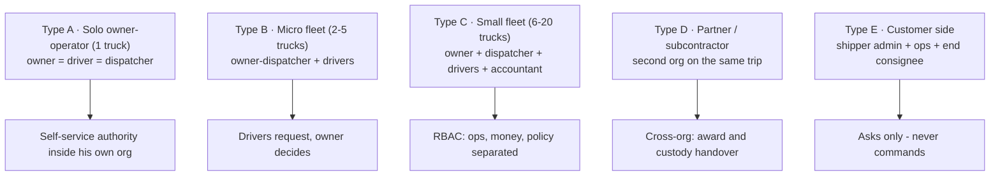
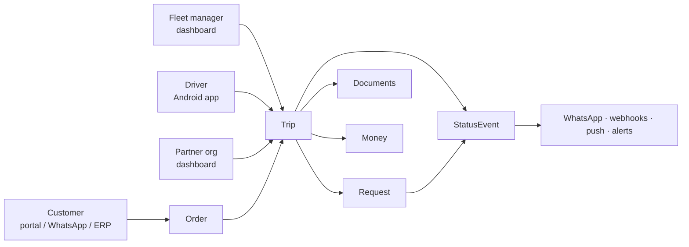

# RoadwiseFleet — UX Flows: Actors, Company Types, Entry Points & Requests

**Read this with the diagrams open:** [roadwisefleet.com/ux-flows](https://roadwisefleet.com/ux-flows) (or the SVG files in [`diagrams/svg/`](../diagrams/svg)).
**Companions:** [information-flow-and-permissions.md](information-flow-and-permissions.md) (permissions matrix) · [product-two-versions.md](product-two-versions.md) (Connect vs Fleet) · [product-menu-plan.md](product-menu-plan.md) (menus)

The six diagrams exist so the permission decisions in the spec can be answered with the whole picture visible.

---

## 1. Company types — who actually exists inside each

| Type | Who exists | Apps they use | Authority shape |
|---|---|---|---|
| **A · Solo owner-operator** (1 truck) | one person = owner + driver + dispatcher | Driver app + **Fleet tab** in the same app | Self-service: no counterparty inside the org, so no internal approvals. Rules only bind him when a **customer or partner** is attached. |
| **B · Micro fleet** (2–5 trucks) | owner-dispatcher (sometimes also drives) + 2–5 drivers | Dashboard (web/mobile) + driver app | Owner decides; drivers **request** anything that changes a commitment. |
| **C · Small fleet** (6–20 trucks) | owner + dispatcher + drivers + accountant | Dashboard (roles) + driver app | RBAC: dispatcher handles ops, accountant handles money, owner sets policy and owns exceptions. |
| **D · Partner / subcontractor** | a **second org** with its own owner/dispatcher/drivers | their own dashboard + driver app | Cross-org trip: award → custody handover → their own internal rules apply on their side; both orgs see one trip. |
| **E · Customer side** | shipper admin (books), shipper ops (tracks), end consignee (receives) | Portal, **WhatsApp**, or their own ERP via API | Asks, never commands: every change is a request with a policy answer. |

**Why this matters:** the same word ("driver") means *three different authority levels* depending on the type — which is exactly why a single flat "driver" role in the schema was wrong, and why `TripActor.relationship` now exists.

---

## 2. Where each party enters (and what leaves)

| Party | Entry | What they bring in | What leaves toward them |
|---|---|---|---|
| Customer | portal · WhatsApp · their ERP (API key) | orders, change/cancel requests, disputes | tracking + ETA, milestone messages, documents (POD/eCMR), invoices, **webhooks** |
| Fleet manager | web dashboard (mobile-friendly) | trips, assignments, rates, decisions, invoices | request inbox, alerts (detention, missing docs, expiring files/SLAs), partner updates |
| Driver | Android app | status, GPS, documents, requests (cancel/reassign/expense/advance) | assignments, decisions, money ledger, parking/community |
| Partner company | their own dashboard | accept/decline loads, their drivers' updates | offered loads, custody handover, shared trip view |

Everything lands on **one trip object**; nothing leaves as a raw state change — only notifications, push, webhooks and alerts.

---

## 3. Request catalogue — what each party may ask for

**Customer:** quote · book · change date/address · cancel order · request documents · track · dispute a charge.
**Fleet manager:** (acts) create/assign/cancel own trip, reassign, subcontract, invoice, mark settlement paid, set policies, invite users · (decides) every inbound request below.
**Driver:** (acts) start trip, update status, deliver, upload POD · (requests) cancellation, reassignment/rescue, delay acknowledgement, expense, advance, clarification, SOS.
**Partner company:** accept/decline offered load · assign own driver · request cancellation of their part · upload documents.

**The platform's shared machinery (same for every request):** policy check → SLA timer → escalate if unanswered → apply on decision → notify only then → audit + webhook.

---

## 4. The decision rules that answer the earlier questions

| Question | Answer in the flow | Where it lives in UX |
|---|---|---|
| Employed driver wants to stop a trip | He **requests**; dispatcher/owner decides; SLA escalation protects him | Driver app → "Cancel" becomes a reason picker with evidence; dashboard → Requests inbox with countdown |
| Solo driver wants out | Pre-award = **withdraw offer** (free, self-service). Post-award = cancel with notice window + rating impact | Connect driver app: "Withdraw" vs "Cancel awarded load" (consequence shown before confirming) |
| Customer wants to change/cancel | **Request** with fee policy after dispatch; fleet may counter-propose a change | Portal/WhatsApp → request tracked as a Request row; customer sees only the decision |
| Who may reassign or subcontract | Owner/dispatcher (and solo owner) — drivers request it | Dashboard → Dispatch; partner gets an offered load |
| Money on cancellation | Policy object decides: notice window, fee %, evidence requirement | Fleet Settings → Policies (edited once, applied everywhere) |

---

## 5. All six diagrams (sources — GitHub renders these)

**1 · Company types & actors**

**2 · Request catalogue** — see the rendered diagram (`12-actor-request-catalog.svg`) for the four party columns beside the platform machinery.

**3 · Entry points & the core object**

**4–6 · Customer journey · Fleet manager flow · Driver flow** — rendered as `14-customer-journey.svg`, `15-fleet-manager-flow.svg`, `16-driver-flow.svg`. Each one shows the entry, the branch points where a *request* begins, and who decides.

---

## 6. The five decisions, now with context

1. **Employed driver cancellation** — always require approval, or auto-approve when evidence (breakdown photo) is attached and the dispatcher does not respond within the SLA? *Recommendation: always require approval; auto-approve only after SLA expiry with evidence.*
2. **Solo driver notice window** — free cancel up to 12 h before planning pickup? *Recommendation: yes; under 12 h = rating impact; after pickup = fee + review.*
3. **Customer fee after dispatch** — a flat % of freight, or per-customer policy? *Recommendation: per-customer policy object with a sane default (e.g. 10 %).*
4. **SLA before escalation** — 2 h in working hours, 30 min after-hours? *Recommendation: yes, with escalation to the owner.*
5. **Publish company-side reliability too** (cancellations, late changes)? *Recommendation: yes — two-way trust is what makes drivers stay.*
